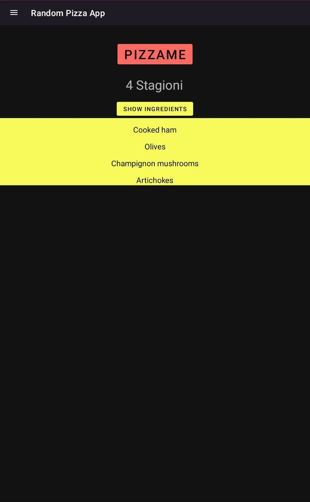
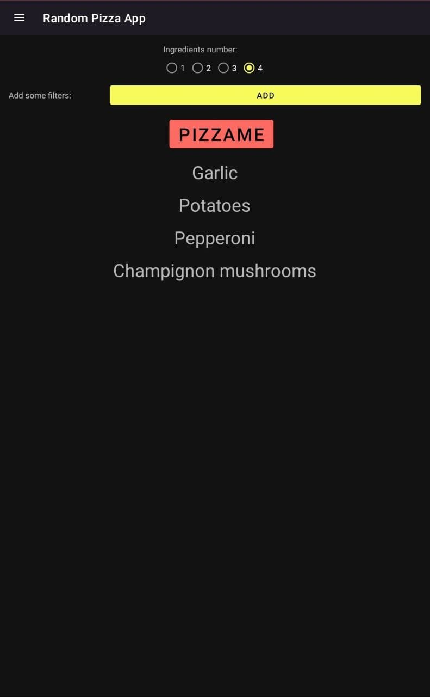

# Random-pizza-app
A simple pizza randomizer app for Android, which makes choosing pizza way easier!

It can randomize traditional pizza or every single ingredient out of it.
The "Good Pizza" mode select only ingredients that would suit/taste good together.
The user is allowed to exclude some categories of food through filters.

The user can swap between a Dark or Light theme. The supported languages are English and Italian.

 
 
